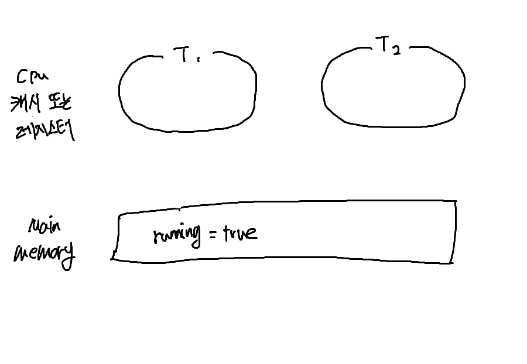
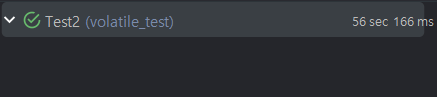

# volatile ?

volatile(vol·a·tile) 일명 볼 에 틀이라 불리는 이 녀석은 어디에 쓰일까?
먼저 volatile 단어의 기원은 변덕스러운 휘발성의이라는 뜻을 가지고 있다.
여기서는 휘발성이라는 키워드가 잘 어울릴 것 같다.

**다음 예시들을 통해서 volatile을 이해해 보자.**

### 예시 1

```java
public class Example {
    boolean running = true;

    public static void main(String[] args) throws InterruptedException {
        Example testRun = new Example();
        testRun.run();
    }

    public void run() throws InterruptedException {
        Thread t1 = new Thread(() -> {
            long counter = 0;
            while (running) {
                counter++;
            }
            System.out.println("스레드 1 상태 종료 " + counter);
        });
        Thread t2 = new Thread(() -> {
            try {
                Thread.sleep(1000);
            } catch (InterruptedException ex) {
            }
            System.out.println("스레드 2 종료");
            running = false;
        });
        t1.start();
        t2.start();
    }
}

```

**_이런 예시가 있다고 생각해 보자 해당 프로그램은 어떻게 동작할까 ?_**

- 결과

```shell
스레드 2 종료
// 영원히 끝나지 않는다.
```

결과를 보면 내가 원했던 대로 실행되지 않음을 알 수 있다.
내가 생각한 실행 순서를 한번 살펴보자.

1. 스레드 t1 시작
2. t1의 while 문은 running 변수가 false로 바뀔 때까지 count를 1씩 계속 증가시킨다.
3. 스레드 t2가 1초 후에 실행되고 이때 `스레드 2 종료`라는 값을 출력하고 running을 false로 바꾸고 종료한다.
4. t1은 while 문을 계속해서 실행 중이었지만 3번에서 t2가 running 값을 false로 바꾸었기 때문에 while 문이 종료되면서 지금까지 count 했던 값을 출력한다.

우리가 생각했던 프로그램의 실행 흐름은 위와 같다.

하지만 4번에서처럼 왜 running 값이 false로 바뀌었는데도 불구하고 우리 프로그램은 영원히 종료되지 않을까??

일단 간단하게 알아보면 이 문제는 가시성이라는 키워드 때문에 생기는 문제이다.
말 그대로 값을 제대로 볼 수 있냐 없냐의 문제인 것이다.
우리는 분명 running의 값을 false로 바꾸었는데 t1은 running 값이 변경된 것을 인지 못했기 때문에 이런 일이 벌어진 것이다. 그 이유가 뭘까?

**메모리의 상태를 실행 순서에 따라서 그림으로 확인해 보자**



> 그림에서 캐시 또는 레지스터라고 표현해둔 것은 c/c++과는 달리 java는 직접 하드웨어를 다루지 않는다.<br> 따라서 cpu 레지스터를 사용할지 cpu 캐시를 사용할지는 jvm 런타임 환경에
> 달려있기 때문에 다음과 같이 표시했다. <br> 여기서 핵심은 레지스터냐 cpu 캐시냐보다는 다음과 같이 해당 값을 따로 캐시 해서 사용한다는 것이다.

#### 순서대로 살펴보자

1. 메인 메모리에 `running = true`라고 적재되어 있는데 t1는 이를 캐싱 해둔다.
2. t2는 메인 메모리에 있는 `running = true`라는 값을 읽어서 `false`로 변경하고 이를 메인 메모리에 반영한다.
3. 하지만 t1는 1번에서 캐시 된 `running = true`를 지속적으로 읽고 있기 때문에 끝나지 않는다.

## 해결하려면 어떻게 해야 될까?

정답은 t1에 캐시 된 running 값을 메인 메모리와 동기화해주면 된다.
이때 필요한 것이 volatile이라는 키워드이다.

volatile을 사용하면 해당 변수는 캐싱을 하는 방식이 아닌 read, write를 할 때 무조건 메인 메모리를 참조하도록 한다.

따라서 이전처럼 캐시 된 값을 읽음으로써 잘못 작동하게 되는 일은 없게 된다. 테스트해 보자

```java
public class TestRun {
    volatile boolean running = true;
    ...
}
```

```shell
스레드 2 종료
스레드 1 상태 종료 1573699816

Process finished with exit code 0
```

이번엔 우리가 생각한 대로 잘 진행되었다.

그럼 여기서 또 의문이 든다. 이렇게 동기화도 되게 해주면 좋은 것 아닌가? 왜 모든 변수에 쓰지 않을까?

## 성능 문제

컴퓨터 구조를 공부했다면 레지스터나 cpu 캐시를 쓰는 이유는 다들 알 것이라 생각한다.

레지스터나 cpu 캐시는 메인 메모리보다 훨씬 빠르기 때문에 cpu가 값을 저장하고 가져올 때 메인 메모리에 접근해서 처리하는 것보다 캐시나 레지스터에
접근해서 처리하는 것이 훨씬 빠르게 연산할 수 있다.

모든 변수를 volatile로 써버린다면 속도가 빠른 레지스터나 cpu 캐시를 활용하지 못하기 때문에 당연히 성능 문제가 뒤따른다.

테스트로(극단적으로) 어느 정도 차이가 나는지 확인해 보자.
### 속도테스트

```java
public class Example {
    /*volatile*/static long value;

    private void add() {
        for (long i = 0; i < 1000000000L; i++) {
            value++;
        }
        System.out.println(Thread.currentThread().getName() + " 종료");
    }

    @Test
    void name() throws InterruptedException {
        Thread a = new Thread(this::add, "a");
        Thread b = new Thread(this::add, "b");
        Thread c = new Thread(this::add, "c");
        Thread d = new Thread(this::add, "d");
        Thread e = new Thread(this::add, "e");
        Thread f = new Thread(this::add, "f");

        a.start();
        b.start();
        c.start();
        d.start();
        e.start();
        f.start();

        a.join();
        b.join();
        c.join();
        d.join();
        e.join();
        f.join();

        System.out.println("value = " + value);
    }
}
```

- **non_volatile**

   

- **volatile**

   

약 50배 정도 차이가 난다. 극단적인 케이스긴 하지만 값이 커질수록 차이는 점점 더 심해진다.

## 그래서 가시성이 뭐냐 하면
멀티 스레드 환경에서는 공유 변수를 어떤 스레드가 수정했을 때 그 값을 다른 스레드가 읽을 수 있냐?라는 성질이 바로 가시성이다.

해당 예시를 보자

```java
class Example {
    int x = 0;
    int y = 0;
    volatile boolean flag = false;

    void write() {
        x = 1;
        y = 1;
        flag = true;
    }

    void read() {
        while (!flag) {
        }
        int a = y;
        int b = x;
    }
}
```

> 해당 코드는 이전의 코드와 거의 비슷하지만 x y라는 non volatile 변수 몇 개가 추가된 예제라고 보면 된다.

만약 여기서 `flag`에 volatile 키워드를 뺀다면 JVM(JIT)이 최적화를(성능 향상) 위해서 코드를 이런 식으로 재정의 할 수도 있다.

```java
  void write(){
        x=1;
        flag=true;
        y=1;
    }
```
이때 스레드 1이 read를 실행한다고 생각하고 스레드 2가 write를 실행한다고 생각해 보자.

원래 예상한 결과가 `a = 1 b = 1` 였다면 재정렬 후의 결괏값은 `a = 0 y = 1`처럼 예상치 못한 결과가 나올 수도 있다.

이렇게 volatile 이용하면 volatile 변수를 기준으로 위끼리 아래끼리는 재정렬 할 수 있지만 위아래 합쳐서는 재정렬 할 수 없게 방지해 줌으로써
가시성을 보장해 줄 수 있다.


## 언제 써야 할까? 비슷한 synchronized는?
volatile 과 synchronized는 어떤 것을 동기화하느냐가 다르다.

volatile은 타깃을 동기화하고 synchronized는 행위(연산)을 동기화한다.

예를 들어 volatile은 여러 스레드가 한 번에 덤벼서 값을 바꾸는 것에 대한 행위는 동기화할 수 없다.

### volatile은 그럼 언제 써야 할까?
- 하나의 스레드로 값을 변경하고 나머지 스레드들은 읽기만 할 때 사용할 수 있다.
### synchronized는?
- synchronized는 원자적 연산을 지원하기 때문에 여러 스레드가 읽거나 쓸 때 사용할 수 있다.
